<h1 align="center">Hi 👋, I'm Huzefa Sadikot</h1>

<h3 align="center">
Machine Learning Engineer · Generative AI · RAG · Backend Engineering
</h3>

<p align="center">
  <a href="https://github.com/Hsadikot95S">
    
  </a>
  <a href="https://linkedin.com/in/huzefa-sadikot">
    
  </a>
  <a href="mailto:sadikothuzi3@gmail.com">
    
  </a>
</p>

<p align="center">
  
</p>

---

## 👨‍💻 About Me

I'm a **Machine Learning Engineer with 3+ years of experience** building and deploying production-grade **Machine Learning, Generative AI, RAG, and backend systems**.

My work spans the complete AI lifecycle:

`Data → Feature Engineering → ML → LLMs → RAG → APIs → Deployment → Monitoring`

### 🔭 Areas I Work In

* 🤖 Machine Learning
* 🧠 Generative AI & LLM applications
* 🔎 Retrieval-Augmented Generation
* 🕸️ LangChain & LangGraph
* 📊 Data Engineering & Feature Engineering
* ⚙️ Python Backend Engineering
* 🌐 REST APIs & Microservices
* 🐳 Docker & Cloud Deployment
* 📈 ML Experiment Tracking & Observability

My professional experience includes production systems using **Azure OpenAI, LangChain, LangGraph, LangSmith, ChromaDB, MLflow, Flask, Docker, Azure Functions, SQL, AWS, and GCP**.

---

# 📊 GitHub Statistics

<p align="center">
  
</p>

<p align="center">
  
</p>

> These cards are generated automatically by GitHub Actions from GitHub data rather than relying on the public statistics endpoint.

---

# 🏆 GitHub Profile

<p align="center">
  
</p>

<p align="center">
  <a href="https://github.com/Hsadikot95S">
    
  </a>
</p>

---

# 🚀 Featured Project

## 🔎 RAG Pipeline

A production-oriented **Retrieval-Augmented Generation pipeline** for document ingestion, embeddings, vector search, retrieval, and LLM-powered responses.

### Pipeline

```text
Documents
    │
    ▼
Document Processing
    │
    ▼
Chunking
    │
    ▼
Embeddings
    │
    ▼
Vector Database
    │
    ▼
Similarity Search
    │
    ▼
Retrieved Context
    │
    ▼
LLM
    │
    ▼
Context-Aware Response
```

### 🛠️ Technology

<p align="left">


</p>

👉 **[View RAG Pipeline](https://github.com/Hsadikot95S/RAG-Pipeline)**

---

# 💼 What I Build

<table>
<tr>
<td width="50%">

### 🤖 Generative AI

* RAG applications
* LLM workflows
* Agentic systems
* Prompt engineering
* Vector search
* Document AI
* Conversational AI
* LLM observability

</td>

<td width="50%">

### 🧠 Machine Learning

* Classification
* Regression
* Lead scoring
* Lead categorization
* Forecasting
* LSTM
* Feature engineering
* Model evaluation

</td>
</tr>

<tr>
<td width="50%">

### ⚙️ Backend Engineering

* Python
* Flask
* REST APIs
* Microservices
* OOP
* Data pipelines
* API integrations
* Docker

</td>

<td width="50%">

### ☁️ Infrastructure

* AWS
* GCP
* Azure
* Docker
* MLflow
* Grafana
* Prometheus
* SQL

</td>
</tr>
</table>

---

# 🛠️ Technology Stack

### Languages

<p align="left">


</p>

### Machine Learning

<p align="left">


</p>

### Generative AI

<p align="left">


</p>

### Backend

<p align="left">


</p>

### Databases

<p align="left">


</p>

### Cloud & DevOps

<p align="left">


</p>

---

# 📈 GitHub Activity

<p align="center">
  
</p>

---

# 🎓 Education

### Master of Science — Computer Science

**Pace University**
Seidenberg School of Computer Science & Information Systems
New York · 2022 – 2024

**GPA: 3.60**

### Bachelor of Engineering — Electronics & Telecommunication

**KJ Somaiya Institute of Engineering & Information Technology**
Mumbai · 2013 – 2018

---

# 📜 Certifications

🏅 **Databricks Certified Generative AI Engineer Associate**

🏅 **Deep Learning Specialization**

---

# 🌱 Currently Exploring

```text
Advanced RAG Architectures
Agentic AI
LLM Evaluation
AI Observability
Scalable ML Systems
Distributed AI Systems
Production AI Engineering
```

---

# 💬 Ask Me About

<p align="center">


</p>

---

# 🤝 Connect With Me

<p align="center">

<a href="https://linkedin.com/in/huzefa-sadikot">

</a>

<a href="https://stackoverflow.com/users/14605345/huzefa-sadikot">

</a>

<a href="mailto:sadikothuzi3@gmail.com">

</a>

<a href="https://github.com/Hsadikot95S">

</a>

</p>

---

<p align="center">

<b>Building intelligent systems that solve real-world problems. 🚀</b>

<br/>

<i>Machine Learning · Generative AI · RAG · Backend Engineering</i>

</p>
